# 🏥 Cuidar+

Sistema web desenvolvido em **Flask** para gestão completa de voluntários, atividades e operações administrativas do Hospital Cajuru.

---

## 📌 Visão Geral

O **Cuidar+** centraliza a rotina de voluntariado em uma plataforma web intuitiva e administrativa, permitindo o gerenciamento eficiente de usuários, atividades, eventos e comunicação interna.

O sistema foi projetado para melhorar a organização, rastreabilidade e tomada de decisão em ambientes com grande fluxo de voluntários.

---

## 📸 Telas

<details>
<summary><strong>Ver capturas de tela do sistema</strong></summary>

<br>

| | |
|:---:|:---:|
| **Login** | **Dashboard — Administrador** |
| 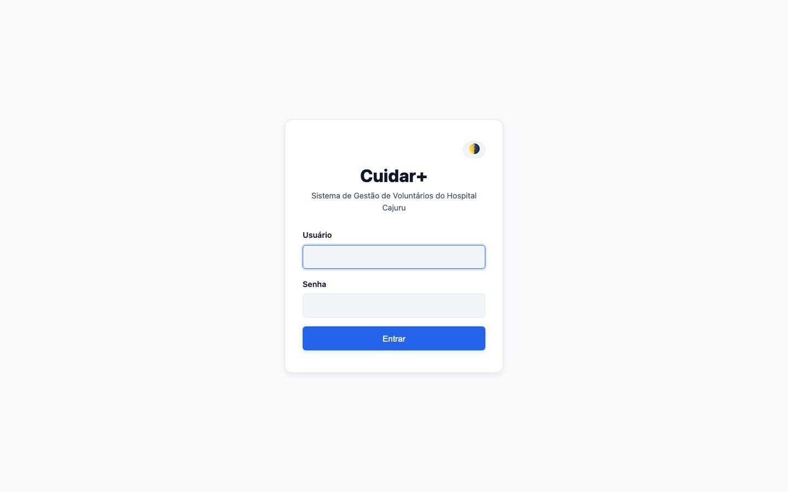 | 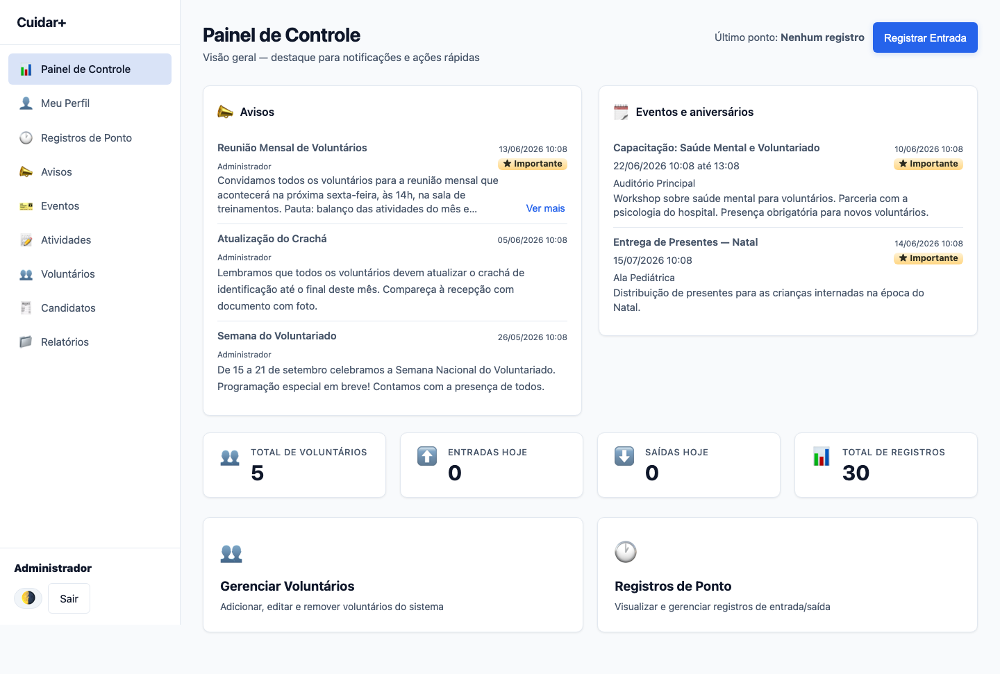 |
| **Dashboard — Voluntário** | **Gestão de Voluntários** |
| 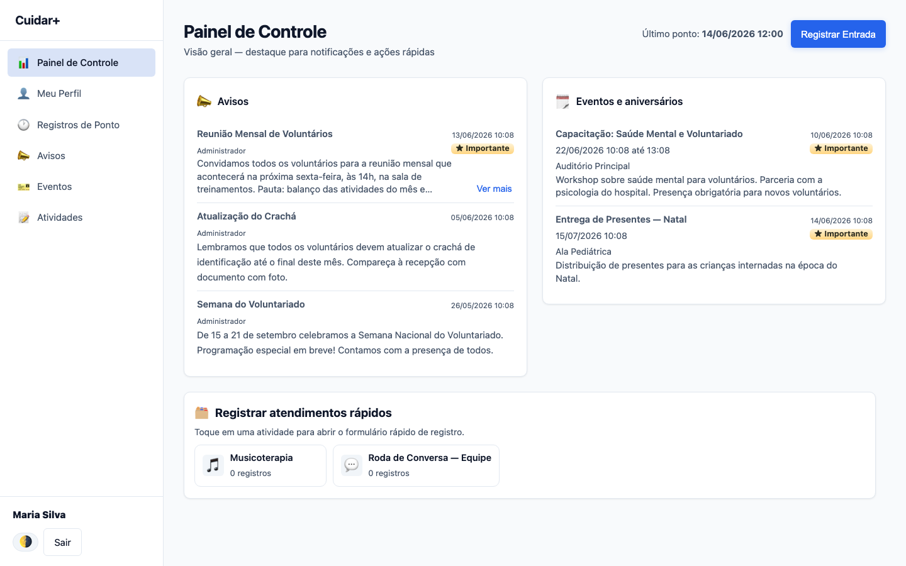 | 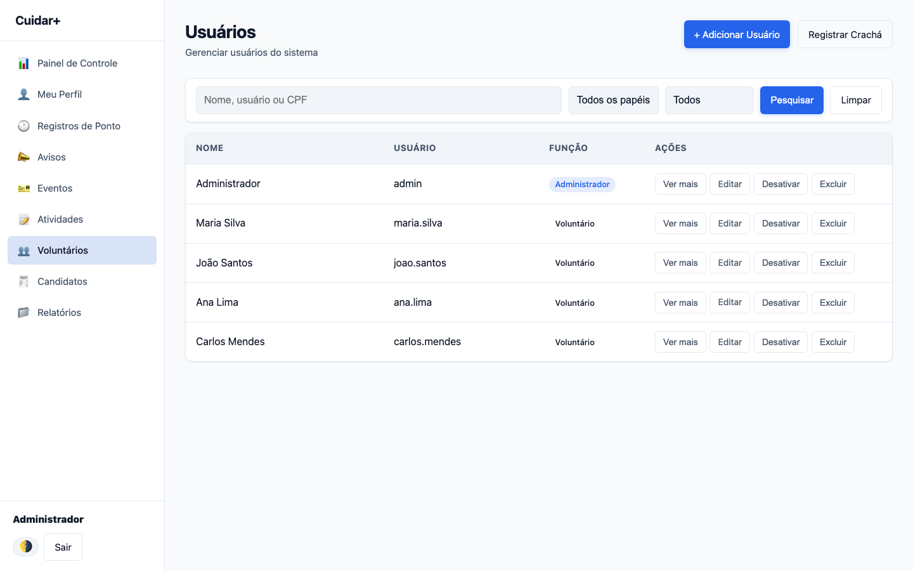 |
| **Controle de Ponto** | **Atividades** |
| 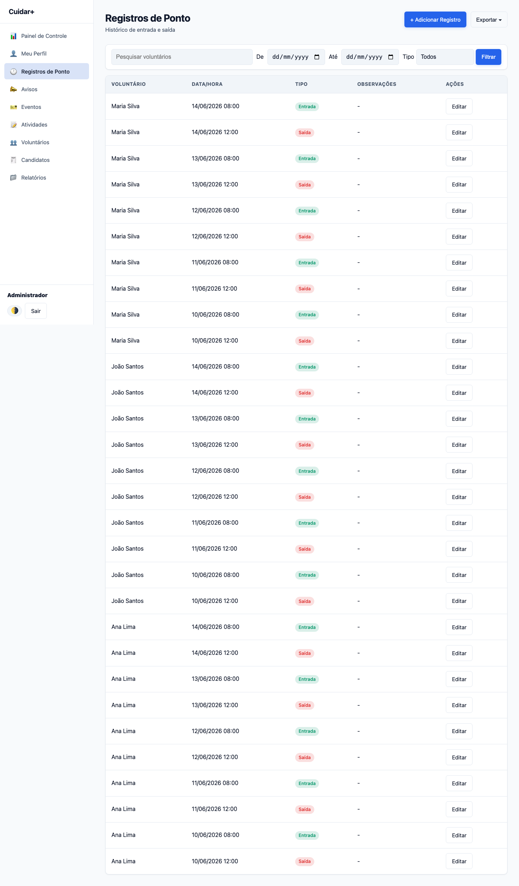 | 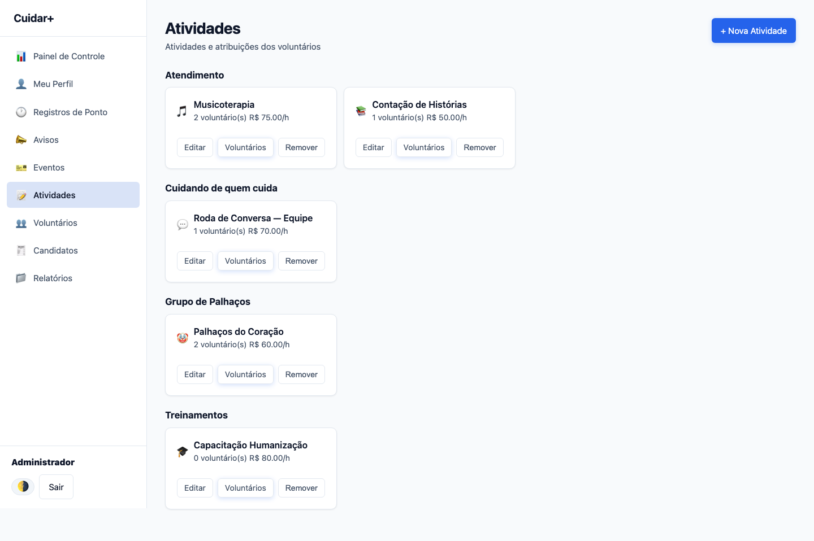 |
| **Avisos** | **Eventos** |
| 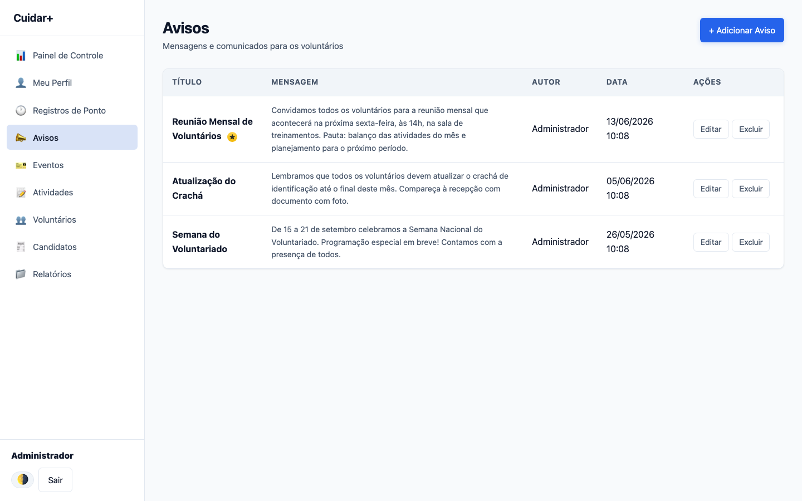 | 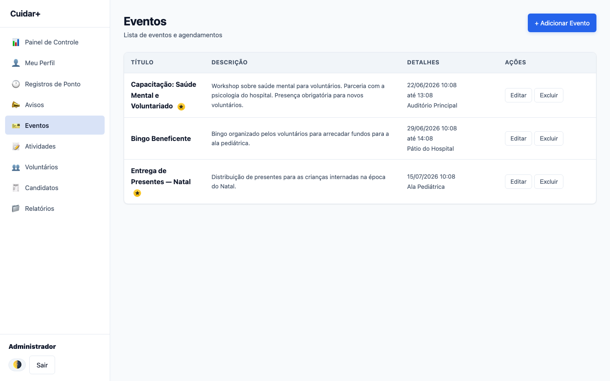 |
| **Escalas** | **Candidatos a Voluntário** |
| 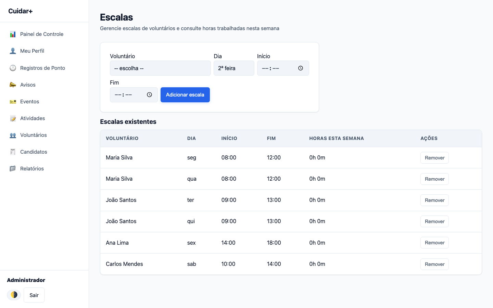 | 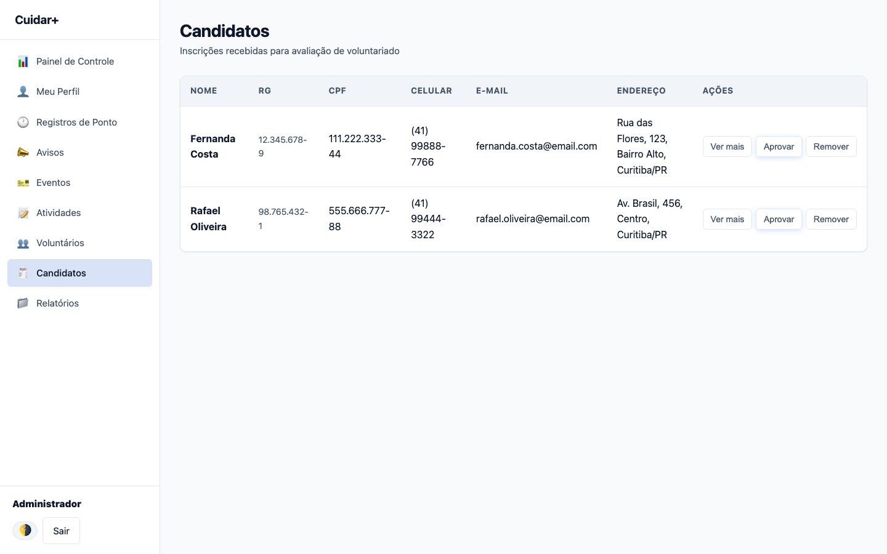 |
| **Relatórios** | **Formulário Público de Intenção** |
| 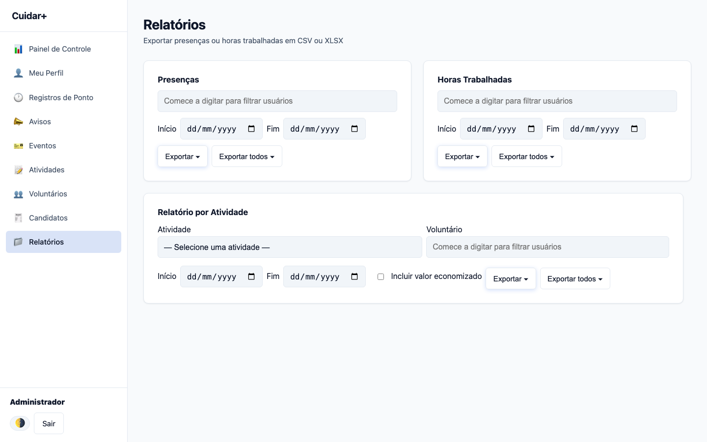 | 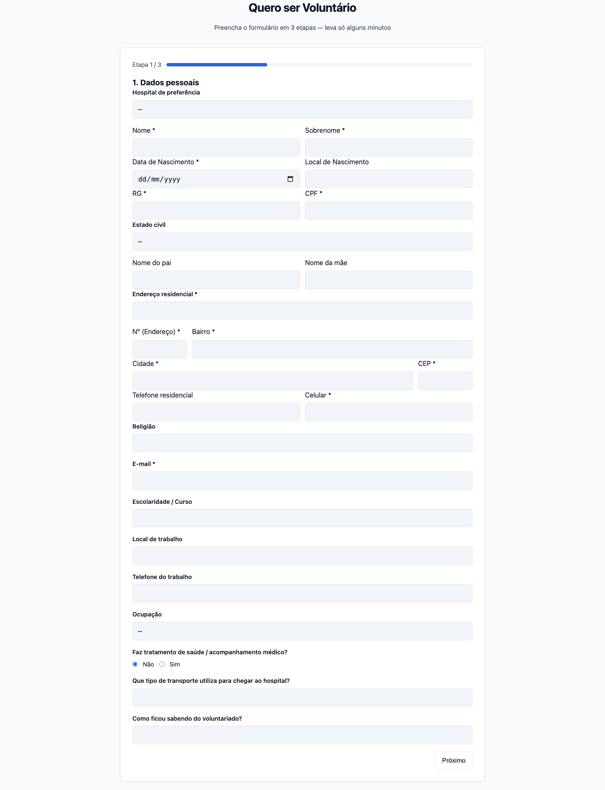 |

</details>

---

## ✨ Funcionalidades

### 👤 Gestão de Usuários
- Autenticação com login e logout
- Edição de perfil (nome e senha)
- Cadastro, edição e desativação de voluntários
- Aprovação de novos usuários via intenção de voluntariado

### ⏱ Controle de Ponto
- Registro de entrada e saída
- Histórico de registros por usuário
- Organização de presença e carga horária

### 📋 Gestão de Atividades
- Cadastro e acompanhamento de atividades
- Organização operacional do voluntariado

### 📢 Comunicação Interna
- Publicação de avisos administrativos
- Dashboard com atualizações recentes

### 📅 Eventos
- Cadastro de eventos com data, horário e local
- Definição de prioridade/destaque

### 📊 Relatórios
- Geração de relatórios administrativos
- Exportação em CSV e XLSX

### 📨 Intenções de Voluntariado
- Formulário público de inscrição
- Aprovação para criação de novos usuários

### 📊 Dashboard
- Visão geral do sistema com:
  - Avisos recentes
  - Eventos
  - Aniversariantes
  - Resumo operacional

---

## 🛠 Tecnologias

- **Backend:** Python, Flask
- **Templates:** Jinja2
- **Autenticação e segurança:** Werkzeug
- **Exportação de dados:** openpyxl
- **Persistência:** JSON (ambiente de desenvolvimento)
- **Integração opcional:** MQTT

---

## 📁 Estrutura do Projeto

```

.
├── run.py                  # Ponto de entrada da aplicação
├── app/
│   ├── controllers/        # Rotas e blueprints
│   ├── models/
│   │   └── storage.py      # Persistência em JSON
│   ├── services/           # Serviços auxiliares (ex: MQTT)
├── templates/              # Templates HTML (Jinja2)
├── static/                 # CSS, JS e assets
├── data.json               # Base de dados local
├── scripts/                # Scripts auxiliares

````

---

## ⚙️ Requisitos

- Python 3.13+
- pip
- Ambiente virtual recomendado

---

## 🚀 Instalação

```bash
# Criar ambiente virtual
python3 -m venv .venv

# Ativar ambiente (Linux/macOS)
source .venv/bin/activate

# Instalar dependências
pip install -r requirements.txt
````

---

## ▶️ Execução

```bash
python run.py
```

A aplicação estará disponível em:

```
http://127.0.0.1:5000
```

---

## 🔐 Variáveis de Ambiente

| Variável    | Descrição                             |
| ----------- | ------------------------------------- |
| HOST        | Host do servidor (default: 127.0.0.1) |
| PORT        | Porta da aplicação (default: 5000)    |
| DEBUG       | Modo debug (default: true)            |
| SECRET_KEY  | Chave secreta da aplicação            |
| DATA_FILE   | Caminho alternativo para o data.json  |
| START_MQTT  | Ativa/desativa serviço MQTT           |
| MQTT_BROKER | Broker MQTT                           |
| MQTT_PORT   | Porta MQTT                            |
| MQTT_TOPIC  | Tópico MQTT                           |

---

## 🔑 Acesso Inicial

Usuário administrador padrão:

```
Usuário: admin
Senha: adm123
```

⚠️ Apenas para desenvolvimento.

Também disponível:

```
/dev-login
```

Login automático em modo debug.

---

## 🌐 Rotas Principais

| Rota           | Descrição             |
| -------------- | --------------------- |
| /login         | Autenticação          |
| /dashboard     | Painel principal      |
| /users         | Gestão de voluntários |
| /clock-entries | Controle de ponto     |
| /activities    | Atividades            |
| /announcements | Avisos                |
| /events        | Eventos               |
| /reports       | Relatórios            |
| /intencao      | Formulário público    |
| /intencoes     | Gestão de intenções   |
| /schedules     | Escalas               |

---

## 💾 Persistência de Dados

O sistema utiliza `data.json` como armazenamento local.

* Criado automaticamente na primeira execução
* Inclui estrutura inicial e usuário admin
* Ideal para ambiente de desenvolvimento

---

## ⚠️ Observações

* MQTT é opcional — o sistema funciona sem ele
* Senhas antigas podem estar em texto puro (compatibilidade)
* Novas senhas são armazenadas com hash
* Interface focada em uso administrativo

---

## 👩‍💻 Autores

* **[Letícia Miniuk Rosa Pereira](https://github.com/ltcmnk)**
* **[Rayssa Gaievicz Grafetti](https://github.com/T-800-888)**
* **[Victor Willian Rodrigues Bittencourt](https://github.com/scourgeyyy)**

---

## 📌 Status do Projeto

🚧 Em desenvolvimento
